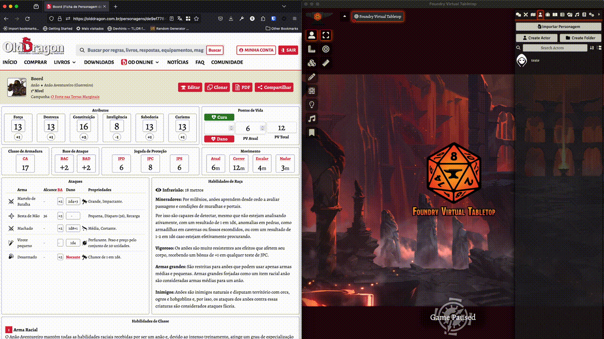

# Old Dragon 2a Edição para Foundry VTT

Sistema do Old Dragon 2a Edição para FoundryVTT.

**Note for English speakers & international community**: Old Dragon 2nd Edition is a Brazilian Tabletop Roleplaying Game and, at this time, is only written in Brazilian Portuguese. Because of that, the rest of this module is written primarely in Portuguese.

## Recursos

- **Criação Personalizada:** Jogadores podem criar Personagens, Monstros & Inimigos e Itens (incluindo Armas, Armaduras, Escudos, Itens Gerais, Recipientes & Vasilhames, Montarias & Transportes) de forma personalizada;
- **Cálculo Automático de Modificadores:** O módulo calcula automaticamente os modificadores de atributos, otimizando o processo de criação e evolução de personagens;
- **Cálculo Automático de Movimento:** O módulo calcula automaticamente as variações de movimento (Correr, Nadar e Escalar) baseado no valor do movimento atual;
- **Cálculo Automático de Carga:** O módulo calcula automaticamente a Carga Máxima e a Carga Atual do personagem. A Carga Máxima é representada pelo maior valor entre os atributos de Força e Constituição, além de bônus provenientes de equipamentos como a Mochila. A Carga Atual leva em consideração a soma da carga de todos os itens que personagem possui. (O peso das moedas ainda não está sendo incluído).
- **Rolagens de Dados Aprimoradas para Personagens:** Inclui rolagens para Atributos, Jogadas de Proteção (JPD/JPC/JPS), Ataques (BAC/BAD), Dano e Chance de Nocaute com opções de Ajuste de Teste e Modificador Opcional;
- **Rolagens de Dados Aprimoradas para Monstros & Inimigos:** Inclui rolagens para Jogada de Proteção (JP), Moral (MO), Dados de Vida/Pontos de Vida (DV/PV), Ataque (BA) e Dano com opções de Ajuste de Teste e Modificador Opcional;
- **Gerenciamento de Magias e Equipamentos:** Permite adicionar, editar, mover, remover e lançar magias, bem como gerenciar equipamentos. Alterações em itens refletem dinamicamente no Peso Total, Valor Total e Carga Atual/Máxima do personagem;
- **Equipar/Desequipar itens**: Permite equipar/desequipar Armas, Armaduras, Escudos, Recipientes & Vasilhames. Armas equipadas são exibidas na aba "Ataques". Ao equipar uma Armadura ou Escudo, os bônus de CA são adicionados automaticamente à Classe de Armadura do personagem. Ao equipar uma Mochila, o valor da Carga Máxima permitida é atualizado automaticamente.
- **Compêndio SRD**: O módulo inclui gratuitamente o compêndio "SRD". Esta coleção concisa e compacta inclui Equipamentos, Magias, Monstros & Inimigos, Tabelas de Rolagem, Personagens Prontos, além do SRD (Documento de Referência) em si, o que possibilita consultar regras e instruções sem a necessidade de sair do aplicativo.
- **Iniciativa (Combat Encounter)**: O módulo utiliza a regra de iniciativa alternativa "Iniciativa Individual", presente no LB2 (pág. 88). Ao adicionar Personagens e Monstros & Inimigos a um Encontro, utilizando o _Combat Encounter_, ao clicar em "Rolar Iniciativa" será lançado 1d12 para cada participante do combate. Os personagens com os resultados mais altos agem primeiro. Por tanto, a ordem das ações será: Maior resultado > 2º maior resultado > 3º maior resultado.

O restante da ficha deve ser preenchida e gerenciada manualmente. Mais abaixo você encontra uma lista de pendências com o que planejamos implementar no futuro.

## Instalação

Para instalar, abra o Foundry, vá em Sistemas (_Systems_) em Instalar Sistema (_Install System_), e busque pelo sistema chamado `olddragon2e`.

Você também pode copiar o link do manifesto abaixo e colar na caixa de manifesto (_Link manifest_):

```text
https://github.com/burobrasil/olddragon2e-foundryvtt/releases/latest/download/olddragon2e.json
```

Opcionalmente, com o FoundryVTT fechado, você pode baixar o arquivo `olddragon2e.zip` da aba de [Releases](https://github.com/burobrasil/olddragon2e-foundryvtt/releases) e colocar dentro do seu FoundryVTT, na subpasta `Data/systems`.

## Pendências

O sistema `olddragon2e` para Foundry VTT está em desenvolvimento contínuo, ainda em versão _alpha_. Abaixo estão listadas as pendências (funcionalidades ainda não desenvolvidas) que gostaríamos de implementar. Se você tem conhecimentos técnicos, sinta-se convidado a contribuir com este sistema de código aberto.

- Controle de uso de Magias;
- Raças e Classes dinâmicas (xp, movimento, infravisão, habilidades);
- Controle de uso de Habilidades de Classe;
- Sistema de Iniciativa (Combat Encounter) padrão do LB1.

## Importação de personagens

O sistema permite importar personagens criados na plataforma [ODO](https://olddragon.com.br/).

Passo a passo: Na aba "Actors", clique em "Importar Personagem do ODO". Insira o link da ficha do personagem escolhido no [ODO](https://olddragon.com.br/) (utilizando o botão de "Compartilhar" da ficha, ou copiando a URL no browser). Por último, basta clicar em "Importar".

Esta funcionalidade ainda será aprimorada. Por tanto, atualmente o personagem importado carrega apenas os seguintes dados: Nome; Raça; Classe; Nível; Movimento; Pontos de Vida; Atributos e Modificadores (Força, Destreza, Constituição, Inteligência, Sabedoria e Carisma).



## Development

### Prerequisites

In order to build this system, recent versions of `node` and `npm` are required. Most likely, using `yarn` also works, but only `npm` is officially supported. We recommend using the latest lts version of `node`. If you use `nvm` to manage your `node` versions, you can simply run

```shell
nvm install
```

in the project's root directory.

You also need to install the project's dependencies. To do so, run

```shell
npm install
```

### Building

You can build the project by running

```shell
npm run build
```

Alternatively, you can run

```shell
npm run build:watch
```

to watch for changes and automatically build as necessary.

### Linking the built project to Foundry VTT

In order to provide a fluent development experience, it is recommended to link the built system to your local Foundry VTT installation's data folder. In order to do so, first add a file called `foundryconfig.json` to the project root with the following content:

```json
{
  "dataPath": ["/absolute/path/to/your/FoundryVTT"]
}
```

(if you are using Windows, make sure to use `\` as a path separator instead of `/`)

Then run

```shell
npm run link-project
```

On Windows, creating symlinks requires administrator privileges, so unfortunately you need to run the above command in an administrator terminal for it to work.

You can also link to multiple data folders by specifying multiple paths in the `dataPath` array.

### Running the tests

You can run the tests with the following command:

```shell
npm test
```

### Creating a release

The workflow works basically the same as the workflow of the [League Basic JS Module Template](https://github.com/League-of-Foundry-Developers/FoundryVTT-Module-Template), please follow the instructions given there.

## Licensing

This project is under [CC BY-SA 4.0](https://creativecommons.org/licenses/by-sa/4.0/deed.pt-br), using the [Old Dragon 2e SRD](https://olddragon.com.br/livros/srd).

This project is being developed under the terms of the [LIMITED LICENSE AGREEMENT FOR MODULE DEVELOPMENT](https://foundryvtt.com/article/license/) for Foundry Virtual Tabletop.
